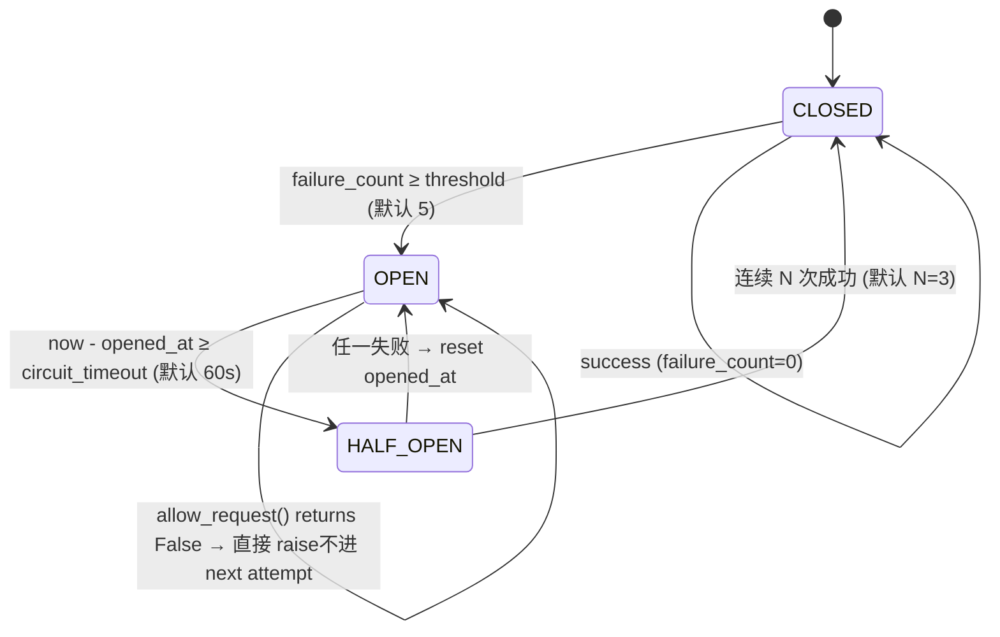

# ADR-0026r1: Outbound 可靠性装饰器 — 修订（熔断 half-open / retry / httpx 白名单）

- **状态**：Accepted（2026-05-28，魈）— 帝君 A 并行拍板后实施约束锁定
- **修订对象**：ADR-0026（原 outbound 可靠性方案）
- **背景**：凝光 S1-REQ-001 评审 + 魈 ADR-0035 §3 独立验证发现 `backend/app/utils/outbound.py` 三处真 bug；ADR-0036 引入 DeepSeek 作为第 4 条 outbound 链路前必须收口
- **关联**：ADR-0035 §3 P0-A / ADR-0036 §4 风险 #1（硬依赖）/ PRD-001 §9（F2 灰度硬依赖）

---

## 1. 三个 bug（来自 ADR-0035 §3 P0-A，已 verified）

| # | 位置 | 现状 | 影响 |
|---|---|---|---|
| B1 | `CircuitBreaker.record_success` (line ~80) | 一次成功即 CLOSED；half-open 无 N 连胜门槛 | 故障下游扑闪（open↔closed 抖动），持续打不健康下游 |
| B2 | `outbound_call` retry except 白名单 (~line 168) | 只接 `RetryableError | TimeoutError`，`httpx.HTTPError / httpx.RequestError` propagate | 绕过熔断 + 重试，承诺的"统一可靠性"穿透 |
| B3 | retry loop CB-open 分支 (~line 138-149) | `cb.allow_request() == False` 抛 `RetryableError` 但**不调 `record_failure`**，attempt#1#2 退化空转 | 浪费 2 个 retry slot，无 backoff 价值；CB timeout 计时锁死在第一次失败 |

---

## 2. 修订决策

### 2.0 CircuitBreaker 状态机（时序图）



**关键语义**：
- HALF_OPEN 中 `_half_open_success_count` 必须连续累加到 N，中间任何一次 failure → reset count + 回 OPEN + reset opened_at。
- OPEN 期间 `allow_request()` False → 调用方直接 raise `RetryableError`，**不进下一次 retry attempt**（修复 B3）。

### 2.1 CircuitBreaker 新增 half-open N 连胜门槛

```python
class CircuitBreaker:
    HALF_OPEN_SUCCESS_THRESHOLD = 3   # 配置化，默认 3

    def __init__(self, threshold, timeout, half_open_success_threshold=3):
        ...
        self._half_open_success_count = 0
        self.half_open_success_threshold = half_open_success_threshold

    def record_success(self):
        if self.state == self.HALF_OPEN:
            self._half_open_success_count += 1
            if self._half_open_success_count >= self.half_open_success_threshold:
                self.state = self.CLOSED
                self.failure_count = 0
                self._half_open_success_count = 0
            # else: stay in HALF_OPEN, keep probing
            return
        # CLOSED 路径不变
        self.failure_count = 0
        self.state = self.CLOSED

    def record_failure(self):
        if self.state == self.HALF_OPEN:
            # half-open 任一失败 → 立即 OPEN + reset 计时
            self.state = self.OPEN
            self._opened_at = time.monotonic()
            self._half_open_success_count = 0
            return
        self.failure_count += 1
        if self.failure_count >= self.threshold:
            self.state = self.OPEN
            self._opened_at = time.monotonic()
```

**语义**：half-open 必须连续 N 次成功才回 CLOSED；期间任何一次失败立刻 OPEN 并 reset timeout 计时。

### 2.2 retry loop CB-open 不进 next attempt

```python
for attempt in range(max_retries + 1):
    if not cb.allow_request():
        # 不再进入下一次 attempt，立刻 raise
        _log_and_record(...)
        raise RetryableError(f"Circuit breaker open for {provider}")
    try:
        ...
```

**语义**：CB open 时**直接 raise，不消耗 retry slot、不调 record_failure**（CB 本身已 open，failure 计数已无意义）。

### 2.3 except 白名单扩 httpx 错 + 状态码分流

```python
except NonRetryableError:
    # 业务声明的不可重试错（4xx 业务逻辑）
    raise
except httpx.HTTPStatusError as exc:
    # 4xx → NonRetryable; 5xx → Retryable
    if 400 <= exc.response.status_code < 500:
        cb.record_success()  # 4xx 不算下游不健康
        raise NonRetryableError(...) from exc
    cb.record_failure()
    last_exc = exc
    retries = attempt + 1
    if attempt < max_retries:
        await asyncio.sleep(backoff_base * (backoff_factor ** attempt))
        continue
    raise RetryableError(...) from exc
except (asyncio.TimeoutError, RetryableError, httpx.RequestError) as exc:
    # 网络层错、超时、显式 Retryable 都走重试 + CB
    cb.record_failure()
    last_exc = exc
    retries = attempt + 1
    if attempt < max_retries:
        await asyncio.sleep(backoff_base * (backoff_factor ** attempt))
        continue
    raise
```

**关键点**：
- 4xx 不污染熔断（下游健康，是我们请求错）→ `record_success`
- 5xx + 网络错 + 超时 → `record_failure` + 退避重试
- 业务声明 `NonRetryableError`（如 wxpay 明确"商户号无效"）→ 直接 raise，不污染熔断

### 2.4 配置项暴露

```python
@outbound_call(
    provider="deepseek",
    timeout=10.0,
    max_retries=2,
    backoff_base=0.5,
    backoff_factor=2,
    circuit_threshold=5,
    circuit_timeout=60,
    half_open_success_threshold=3,   # 新增
)
async def call_deepseek(...): ...
```

各 provider 按业务特性调（支付/SMS 严控、AI 可宽松）。

---

## 3. Acceptance（W19 P0-04 develop task done 门槛）

1. ✅ B1 修复：half-open 连续 N 次成功才 CLOSED；期间任一失败立刻 OPEN
2. ✅ B2 修复：`httpx.HTTPStatusError` 按 4xx/5xx 分流；`httpx.RequestError` 进 retry + CB
3. ✅ B3 修复：CB open 时直接 raise，不进 next attempt、不空转
4. ✅ 单测覆盖（建议 `tests/utils/test_outbound.py` 全量重写）：
   - CB 状态机全转换：CLOSED→OPEN（threshold 触发）/ OPEN→HALF_OPEN（timeout）/ HALF_OPEN→CLOSED（N 连胜）/ HALF_OPEN→OPEN（任一失败）
   - httpx 4xx 不污染 CB / 5xx 污染 CB / RequestError 进 retry
   - CB open 时 retry loop 不空转（assert attempt 调用次数 = 1）
   - half-open 期 N-1 次成功不 close、N 次成功 close
5. ✅ Prometheus metric `outbound_circuit_state{provider}` 新增 state gauge（0/1/2 对应 closed/open/half-open）
6. ✅ 所有现有 provider（wxpay / aliyun_sms / redis pubsub）回归测试通过
7. ✅ DeepSeek provider 接入示例（ADR-0036 落地前置）

---

## 4. 风险

- **回归风险**：核心可靠性组件改动，wxpay 真实回调路径必须人工 staging 测一遍（刻晴 W19 release gate）
- **配置默认值**：`half_open_success_threshold=3` 是经验值；上线后按 Prometheus 真实数据调

---

## 5. 后续

- 本 ADR 由 W19 P0-04 develop task 实施完成后 → Accepted
- 与 ADR-0026 关系：本 ADR 为修订，原 ADR 保留作为历史背景；实施完成后在 ADR-0026 头部加「→ 见 ADR-0026r1 修订」link
- ADR-0036 §4 风险 #1 / PRD-001 §9 「F2 灰度硬依赖」可在 P0-04 done 后解除
