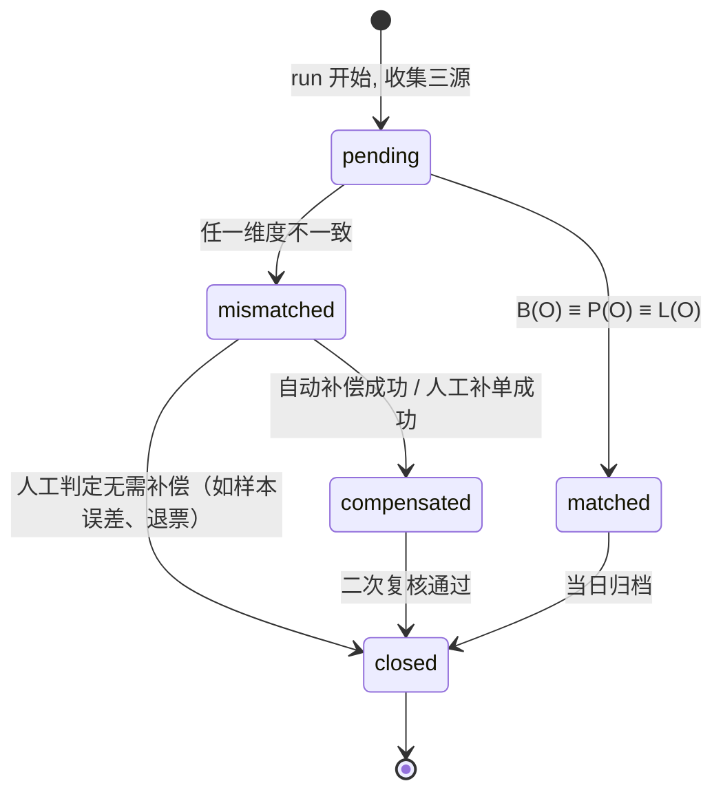

# ADR-0032 资金对账机制（Money Reconciliation）

- 编号：ADR-0032（原任务卡 TD-MONEY-01 中暂定 ADR-0030，已与现有 `ADR-0030-staging-mock-environment.md` 撞号，本稿改记 ADR-0032，待 Arch 评审时一并确认编号归档）
- 日期：2026-04-28
- 状态：Proposed
- 关联：TD-MONEY-01、ADR-0029（紧急呼叫 PII 加密 / KMS 信封加密）、ADR-0026（outbound 可靠性，audit_event 同源）、`app/services/payment_service.py` 与 `payment.provider` 接口
- 参与角色：Arch / 后端 / Finance / SRE

---

## 1. Context（背景）

发布收口期 W18 Day 2，Provider 接口已稳定 16 天等外部凭证。在外部凭证真正落地之前，我们必须把「钱」这条路打牢——否则一旦从 mock 切到真实微信支付，**任何一笔回调丢失/重复/乱序都会直接体现在用户账户和商家结算上**。

当前生产数据面上，「一笔订单的资金真相」散落在三处：

1. **`orders`**：业务侧权威状态。`status` ∈ `created / accepted / in_progress / completed / reviewed / cancelled_* / expired`，`price` 是 `Numeric(10,2)`，由 `SERVICE_PRICES` 决定。订单状态转移由 `ORDER_TRANSITIONS` 严格守卫。
2. **`payments`** + **`payment_callback_log`**：支付/退款流水。`payments` 按 `(order_id, payment_type)` 唯一，承载 `amount / status / trade_no`；`payment_callback_log` 记录每一条 provider 回调，按 `(provider, transaction_id)` 全局唯一，是回调侧的幂等防线。
3. **钱包**（当前由 `WalletService.get_summary` 临时由 `OrderRepository.sum_earnings_by_companion` 即时聚合得到）：**目前并没有独立的账本表**，余额是按订单状态推导出来的。这在「订单状态 = 资金真相」的一致世界里能成立，但只要回调与订单状态出现裂缝，钱包数字立刻失真。

三处真相源易出现不一致的常见路径：

- **回调丢失**：微信侧已扣款，平台未收到 `pay.success`，结果是 `orders.status = created` 但 `payments.status = pending`，钱包对此订单一无所知。
- **回调重复**：网络重试 + 我们幂等键失效，导致同一 `transaction_id` 被处理两次，`payments` 自身被 `uq_payment_order_type` 兜住，但派生影响（如积分、佣金）可能被重复触发。
- **回调乱序**：refund 早于 pay 落库（极端 mock 场景或 provider 异步消息），出现「未支付却已退款」的纸面状态。
- **金额不符**：上游优惠券/折扣口径漂移，导致 `orders.price ≠ payments.amount`，目前没有任何后台 cron 在比对。
- **跨日切换**：T+0 内一切看起来正常，但跨日之后由于 timezone / 回调延迟，今天的对账窗口里看不到昨天 23:58 的成功支付。

更关键的是：**今天我们没有一个能回答「截至 02:00，全平台资金账目是否平」这个问题的系统**。Finance 现在只能对着 `payments` 表手工 `SELECT SUM`，没有 diff、没有补偿、没有审计闭环。一旦 Provider 接口接通真实凭证，监管/审计/退款纠纷会立刻把这条短板暴露出来。

TD-MONEY-01 的目标，就是在 Provider 真实联调前，把「资金对账」这条骨架立起来。

---

## 2. Decision（决策）

### 2.1 三方对账模型（Three-Source Reconciliation）

引入显式的三方对账模型，把上述三处真相源对齐：

| 数据源 | 存储 | 角色 |
| --- | --- | --- |
| **业务真相** | `orders.status` + `orders.price` | 「这笔订单应该收/退多少钱、当前业务在哪一环」 |
| **流水真相** | `payment_callback_log`（已存在）+ `payments` | 「provider 实际通知我们入账/出账的事件流」 |
| **账本真相** | `wallet_ledger`（**本 ADR 新增**） | 「钱包侧逐笔追加的不可变账本，余额是它的 fold」 |

> 注：当前 `WalletService` 是即时聚合 `Order` 表得到余额，这种「派生型钱包」无法在对账中扮演独立证人。本 ADR 要求把钱包升级为**追加式账本**（`wallet_ledger`），由支付成功/退款成功事件**单向**驱动写入，余额永远等于账本的 SUM，从而把钱包变成可独立对照的第三方。

**一致性定义**：对一笔订单 `O`，记
- `B(O)`：业务侧应收/应退金额（由 `orders.price` 与 `orders.status` 推导）
- `P(O)`：流水侧实际入账/出账金额（由 `payments` + `payment_callback_log` 聚合）
- `L(O)`：账本侧实际记账金额（由 `wallet_ledger` 聚合）

要求在对账窗口内：`B(O) ≡ P(O) ≡ L(O)`，且三者的状态相位一致（业务 = `completed/refunded` ↔ 流水 = `success` ↔ 账本 = 已记账）。

### 2.2 对账窗口

- **T+1 全量对账**：每天 02:00（GMT+8，与 ADR-0029 的 emergency cron 03:00 错峰，与现有备份窗口对齐）跑全量对账，扫描 `triggered_at ∈ [今日 00:00 - 27h, 今日 00:00 - 3h]` 的订单，覆盖跨日延迟回调。
- **5 分钟增量准实时校验**：`payment_callback_log` 落库即向队列推一条 `recon.incremental` 消息，对应订单做单点对账；同时一个 5 分钟窗口的 sweeper 兜底处理队列丢失。

T+1 全量是「兜底真相」，5 分钟增量是「快速发现」，二者不互相替代。

### 2.3 差异分类（Diff Taxonomy）

把所有差异收敛到 4 类，便于补偿策略和告警分级：

| 类型 | 触发条件 | 默认补偿 |
| --- | --- | --- |
| `MISSING_PAYMENT` | 订单存在 + 业务侧应收 > 0，但流水侧无对应 success 流水 | 主动调用 provider `query_order` 拉一次，命中即幂等回放 |
| `ORPHAN_PAYMENT` | 流水侧有 success，但订单不存在 / 已 cancelled | 冻结流水 → 转人工审核（**不自动退款**） |
| `AMOUNT_MISMATCH` | `B(O)` ≠ `P(O)` 或 `P(O)` ≠ `L(O)` | 不自动补偿，必须人工介入；阻断该订单后续状态转移 |
| `STATUS_MISMATCH` | 金额相等但状态相位错位（如 `paid + cancelled` 未触发 refund） | 视子类决定：可推进的状态自动幂等推进；否则转人工 |

### 2.4 补偿策略

- **自动补偿**走「幂等回放」：对 `MISSING_PAYMENT` 类，对账器以 `(provider, provider_txn_id)` 为幂等键，重新调用 `payment_service` 内部 handler，复用既有 `payment_callback_log` 唯一约束防重；任何一步失败，diff 状态退回 `mismatched`，不进入 `compensated`。
- **人工兜底**：所有 `AMOUNT_MISMATCH` 与升级后的 `ORPHAN_PAYMENT` 走 admin H5 的「资金对账工单」页面，由运营+财务双签后才能 `closed`。
- 自动补偿次数硬上限 = 3 次/订单/24h，超过则强制转人工，避免补偿风暴。

---

## 3. 核心设计

### 3.1 幂等键

全局幂等键统一为 `(provider, provider_txn_id)`：

- `provider` ∈ `{wechat, mock}`，与现有 `payment_callback_log.provider` 取值对齐。
- `provider_txn_id` 对支付 = 微信 `transaction_id`，对退款 = `out_refund_no`/`refund_id`，对 mock 测试 = `out_trade_no`，与 `payment_callback_log.transaction_id` 保持同源同语义。
- 幂等键既用于 `payment_callback_log` 入库防重，也用于对账自动补偿时的回放防重，**严禁两套语义**。

### 3.2 对账记录的状态机



`closed` 是终态，归档后只读。`mismatched → compensated` 必须由幂等回放成功触发；`mismatched → closed` 必须有 admin 工单 ID 关联。

### 3.3 数据模型草案（DDL 草稿）

> 字段命名沿用现有约定：UUID 主键、`Numeric(10,2)` 金额、`TIMESTAMPTZ` 时间、`status` 用枚举、`created_at`/`updated_at` 标配。

```sql
-- 1. 对账批次：每次跑一行
CREATE TYPE recon_run_kind   AS ENUM ('full_t1', 'incremental');
CREATE TYPE recon_run_status AS ENUM ('running', 'success', 'partial', 'failed');

CREATE TABLE reconciliation_runs (
    id              UUID PRIMARY KEY,
    kind            recon_run_kind   NOT NULL,
    status          recon_run_status NOT NULL DEFAULT 'running',
    window_start    TIMESTAMPTZ NOT NULL,
    window_end      TIMESTAMPTZ NOT NULL,
    orders_scanned  INTEGER     NOT NULL DEFAULT 0,
    diffs_found     INTEGER     NOT NULL DEFAULT 0,
    diffs_auto_fixed INTEGER    NOT NULL DEFAULT 0,
    started_at      TIMESTAMPTZ NOT NULL DEFAULT now(),
    finished_at     TIMESTAMPTZ,
    triggered_by    VARCHAR(32) NOT NULL,    -- 'cron' | 'queue' | 'admin'
    notes           TEXT
);
CREATE INDEX ix_recon_runs_window ON reconciliation_runs (window_start, window_end);
CREATE INDEX ix_recon_runs_status ON reconciliation_runs (status, started_at DESC);

-- 2. 差异：每笔不平的订单一行
CREATE TYPE recon_diff_kind AS ENUM
    ('missing_payment', 'orphan_payment', 'amount_mismatch', 'status_mismatch');
CREATE TYPE recon_diff_status AS ENUM
    ('pending', 'matched', 'mismatched', 'compensated', 'closed');

CREATE TABLE reconciliation_diffs (
    id              UUID PRIMARY KEY,
    run_id          UUID NOT NULL REFERENCES reconciliation_runs(id) ON DELETE RESTRICT,
    order_id        UUID,                       -- ORPHAN_PAYMENT 时可为 NULL
    provider        VARCHAR(32) NOT NULL,
    provider_txn_id VARCHAR(128),               -- 与 payment_callback_log.transaction_id 同源
    kind            recon_diff_kind   NOT NULL,
    status          recon_diff_status NOT NULL DEFAULT 'pending',
    -- 三源快照（不可变，落库即冻结）
    business_amount NUMERIC(10,2),
    payment_amount  NUMERIC(10,2),
    ledger_amount   NUMERIC(10,2),
    business_status VARCHAR(32),
    payment_status  VARCHAR(32),
    ledger_status   VARCHAR(32),
    -- 自动补偿计数（24h 滚动窗口由查询时间裁剪）
    auto_retry_count INTEGER NOT NULL DEFAULT 0,
    last_error      TEXT,
    created_at      TIMESTAMPTZ NOT NULL DEFAULT now(),
    updated_at      TIMESTAMPTZ NOT NULL DEFAULT now(),
    closed_at       TIMESTAMPTZ
);
-- 幂等：同一 run 内同一笔订单只允许一条 diff
CREATE UNIQUE INDEX uq_recon_diffs_run_order
    ON reconciliation_diffs (run_id, order_id)
    WHERE order_id IS NOT NULL;
CREATE INDEX ix_recon_diffs_status ON reconciliation_diffs (status, created_at DESC);
CREATE INDEX ix_recon_diffs_provider_txn ON reconciliation_diffs (provider, provider_txn_id);

-- 3. 处置动作：每次自动/人工动作一行（追加式审计）
CREATE TYPE recon_action_kind AS ENUM
    ('auto_replay', 'manual_close', 'manual_refund', 'manual_credit', 'escalate');

CREATE TABLE reconciliation_actions (
    id          UUID PRIMARY KEY,
    diff_id     UUID NOT NULL REFERENCES reconciliation_diffs(id) ON DELETE CASCADE,
    kind        recon_action_kind NOT NULL,
    actor_id    UUID,                   -- NULL = system
    payload     JSONB,                  -- 动作上下文（工单号、provider 回放响应等）
    outcome     VARCHAR(16) NOT NULL,   -- 'success' | 'failed'
    error       TEXT,
    created_at  TIMESTAMPTZ NOT NULL DEFAULT now()
);
CREATE INDEX ix_recon_actions_diff ON reconciliation_actions (diff_id, created_at DESC);
```

并行新增 `wallet_ledger`（详见 §3.5），由本 ADR 提出但落表迁移与本表三件套同一 alembic revision 提交。

### 3.4 触发机制

- **cron**：每天 02:00 `backend/app/cron/reconcile_money.py` 跑全量；窗口 `[今日 00:00 - 27h, 今日 00:00 - 3h]`，覆盖跨日延迟与 timezone。
- **队列**：`payment_callback_log` 入库后 `INSERT ... RETURNING id` → 推 `recon.incremental` 消息（与 ADR-0026 的 outbound 可靠性同一基础设施，复用 outbox 模式），消费者在 5 分钟内对单订单做对账。
- **手动**：admin H5 提供「按订单号 / 按时间窗口」的手动触发入口，复用同一 `reconcile_run`，`triggered_by='admin'`。

### 3.5 钱包账本（wallet_ledger，新增）

最小必需字段：`(id, user_id, order_id, provider_txn_id, amount, direction[in|out], reason[pay|refund|adjust], occurred_at, created_at)`，对 `(provider_txn_id, direction)` 加唯一索引以幂等。`WalletService.get_summary` 改为 `SUM(amount * sign(direction))`。该表的引入是本 ADR 的**前置依赖**，列入 M1 范围。

### 3.6 可观测性

- Prometheus metrics：
  - `reconciliation_diff_count{kind, status}`（Gauge，每 run 结束刷新）
  - `reconciliation_lag_seconds{kind}`（Gauge，最新 run 的 `finished_at - window_end`）
  - `reconciliation_auto_fix_total{outcome}`（Counter）
- 告警阈值（Alertmanager）：
  - `reconciliation_diff_count{status="mismatched"} > 0` 持续 15 分钟 → 企业微信 P2
  - `reconciliation_diff_count{kind="amount_mismatch"} > 0` → P1，立即告警
  - `reconciliation_lag_seconds{kind="full_t1"} > 4h` → P2
  - 全量 cron 失败（`status='failed'`）→ P1
- audit_event：所有 `reconciliation_actions` 同步写一条 `audit_event`，与 ADR-0026 链路同源，用于 SOX 审计追溯。

---

## 4. Pure-function 优先

对账核心算法做成纯函数，签名形如：

```python
def diff_orders(
    business: Mapping[UUID, BusinessSnapshot],
    payments: Mapping[UUID, PaymentSnapshot],
    ledger:   Mapping[UUID, LedgerSnapshot],
) -> list[ReconDiff]:
    ...
```

- 三个入参是**纯数据**（dataclass / TypedDict），不持 Session、不发 IO。
- 输出 `list[ReconDiff]` 是**确定性**的：同样的三源快照永远得到同样的 diff 列表（按 `order_id, kind` 字典序排序）。
- 单元测试覆盖率目标 ≥ 95%，至少包含：四类 diff 各 2 条、跨日边界 2 条、退款乱序 2 条、金额浮点边界（`Decimal("0.01")` 累加溢出）2 条。
- IO 层（DB 查询、provider 回放、metric 推送）在外层薄壳里组装，纯函数本身不出现 `await`。

这套设计直接复用了 957 测试已经形成的「pure-core / IO-shell」骨架（参考 `payment_service.py` 的回调处理函数已经在向纯函数化收敛），ADR 只是把它在对账域里立成硬规矩。

---

## 5. Consequences（影响）

### 5.1 正面

- **金额安全兜底**：T+1 + 5 分钟双层窗口意味着任何金额不一致最长 5 分钟（极端情况 24h）内被发现。
- **合规审计可追溯**：`reconciliation_runs / diffs / actions` + audit_event 双写，满足 SOX/等保对资金类操作的「可追溯、不可抵赖、可重放」三要件。
- **退款链路可信**：`ORPHAN_PAYMENT` 不自动退款 + `AMOUNT_MISMATCH` 阻断状态推进，杜绝「自动化把钱退错」。
- **Provider 切换信心**：mock → wechat 真实凭证切换前，对账系统已经在 mock 流量上跑过 N 天，回归风险显著下降。

### 5.2 负面 / 成本

- 数据面新增 3 张表（`reconciliation_runs / diffs / actions`） + 1 张钱包账本（`wallet_ledger`）。
- 运行面新增 1 个 cron（02:00 T+1） + 1 个队列消费者（5 分钟增量），需要 SRE 纳入监控。
- 前端新增 admin H5 「资金对账工单」页面（列表 / 详情 / 关单），需要前端 ~3 人日。
- 现有 `WalletService.get_summary` 由「派生」改为「账本聚合」，需要数据回填（一次性 backfill 脚本，不计入本 ADR 范围，但列入 M1 任务卡）。

### 5.3 迁移

- alembic revision **必须手写**（含 `recon_run_kind / recon_run_status / recon_diff_kind / recon_diff_status / recon_action_kind` 共 5 个枚举），**不能依赖 autogenerate**——这是 ADR-0029 与历史多次 enum 漂移留下的硬教训：autogenerate 对 `CREATE TYPE` 的生成顺序、对枚举值新增的 `ALTER TYPE ADD VALUE` 都不可靠。
- 同一 revision 内拆 `op.execute("CREATE TYPE ...")` → `op.create_table(...)` → `op.create_index(...)`，downgrade 反向 `DROP TABLE` → `DROP TYPE`，并配 `pytest` 迁移可逆性测试。
- 上线 backfill：先空表上线，开 cron 跑一晚验证 diff 噪声，再在低峰期对历史 90 天订单做 backfill 写入 `wallet_ledger`。

---

## 6. Alternatives Considered（替代方案）

### 6.1 只做 T+1 全量

**做法**：去掉 5 分钟增量队列，每天 02:00 一次全量对账。

**为什么不**：

- 平均发现延迟 ~12h，金额不符在用户感知前才被发现概率高。
- 对账失败重试只能等到次日 02:00，故障窗口 = 1 天。
- 对 `MISSING_PAYMENT` 类的自动补偿延迟过大，期间用户可能已经发起客诉/退款。

**保留点**：T+1 全量本身仍是兜底真相，本方案保留。

### 6.2 完全依赖支付平台对账文件

**做法**：直接拉微信支付每天下发的对账文件（`downloadbill`），与本地 `payments` 比对，不引入 `wallet_ledger` 也不引入跨源 diff 模型。

**为什么不**：

- 微信对账文件是 T+1 出，比我们自身的 T+1 更晚；增量场景完全不适用。
- 只能比对「我们 vs 微信」，比对不到「我们的钱包账本 vs 我们的订单」，对**内部一致性问题**（钱包账本漂移、状态机漂移）无能为力。
- 对 mock provider / 未来可能扩展的其他 provider 不通用。

**保留点**：未来可作为 `MISSING_PAYMENT` 自动补偿的另一信源（外部第三方证人），列入 M3+ 的可选增强，不阻塞本 ADR。

### 6.3 同步事务保证三源一致（强一致方案）

**做法**：把订单状态变更、payment 写入、wallet_ledger 写入塞进同一个 DB 事务。

**为什么不**：

- 写入路径已经横跨「provider 回调入站」「订单状态机」「钱包账本」三个域，强一致事务等于把回调链路与业务链路死锁在一起，回调延迟会直接拖垮订单接口。
- 对回调丢失/乱序无能为力（事务无法保证「事件一定来过」）。

**结论**：仍走「事件 + 对账」最终一致，本 ADR 决策不变。

---

## 7. Open Questions（待 Arch 评审拍板）

1. **ADR 编号**：本稿因撞号改记 ADR-0032，是否就此确认？或将现有 `ADR-0030-staging-mock-environment.md` 重新编号？
2. **`wallet_ledger` 的所有权**：账本表归属「支付域」还是「钱包域」？影响后续 `app/services/` 子目录拆分。当前默认放 `app/services/wallet/`，与 `payment_service.py` 解耦。
3. **`AMOUNT_MISMATCH` 是否阻断订单状态机**：默认阻断（拒绝下一次 `ORDER_TRANSITIONS`），但可能影响极端边界订单（如已 reviewed 的历史订单 backfill 出 diff）。需要 Finance 确认接受度。
4. **对账数据保留期**：`reconciliation_runs / diffs / actions` 是否参考 ADR-0029 设 180 天滚动清理？倾向是 **审计类不清**，但需要 PM 给合规口径。
5. **mock provider 是否纳入对账**：staging 环境是否对 mock 流水也跑 cron？倾向跑（验证算法），但 metric 与告警分通道，避免污染生产告警。

---

## 8. Rollout Plan

分 3 个里程碑，与 W18~W20 发布节奏对齐。

### M1：数据模型 + 纯函数算法（W18 末 ~ W19 初，~5 人日）

- alembic 手写 revision：`reconciliation_runs / reconciliation_diffs / reconciliation_actions / wallet_ledger` 一次性建表 + 5 个枚举。
- `app/services/reconciliation/diff.py`：实现 `diff_orders()` 纯函数 + dataclass 三源快照。
- 单测覆盖率 ≥ 95%，包含跨日 / 乱序 / Decimal 边界。
- `WalletService.get_summary` 改为读 `wallet_ledger`（含 backfill 脚本，不上线 cron）。
- 出口：CI 全绿，957 测试 → 目标 ≥ 985 测试。

### M2：cron T+1 全量（W19 末，~3 人日）

- `backend/app/cron/reconcile_money.py`：组装 IO 层，调 `diff_orders()`，写 3 张表。
- Prometheus metrics + Alertmanager 规则。
- 在 staging 跑 7 天观察噪声水位，调阈值。
- 出口：staging 7 天连续 `success` 且 mismatch 噪声可解释。

### M3：增量 + 自动补偿 + admin 工单（W20，~5 人日）

- 队列消费者：`recon.incremental` 5 分钟窗口对账。
- 自动补偿幂等回放（复用 `payment_service` 内部 handler）。
- admin H5 工单页面（列表 / 详情 / 关单 / 手动补单），双签流程。
- 出口：生产灰度 1 周，自动补偿成功率 ≥ 90%，人工工单平均关闭时长 ≤ 24h。

---

_本 ADR 不引入业务代码改动；本次 commit 仅落地文档，所有实现走对应 PR。_
