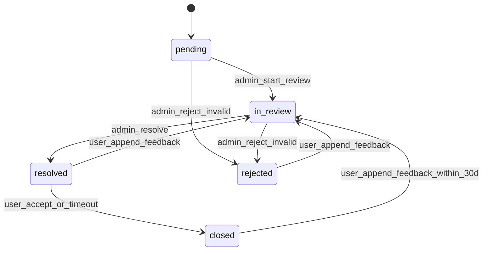

# ADR-0049 — 用户/家属反馈领域模型与附件存储

> 状态：**Draft（待胡桃/刻晴 review + Owner Accept）** · 作者：魈 · 日期：2026-06-06
> 关联：PRD-004 v0.3 / S3-REQ-004 / ADR-0041 状态机解耦 / ADR-0045 StorageBackend ABC / ADR-0048 ABAC 4 层防御
> 触发：帝君 2026-06-06 03:28 UTC Accept PRD-004；S3-DES-004 设计 task
> Owner Approval：**Pending**

---

## 1. 背景

PRD-004 要求建立用户/家属反馈采集通路：订单完成页、家属共享落地页、客服代录、admin-v2 处理、陪诊师端摘要与申诉。

硬约束：

1. 反馈不能污染 `OrderStateMachine`，沿用 ADR-0041/0047 的状态机解耦原则。
2. 反馈截图/附件必须复用 ADR-0045 `StorageBackend` ABC，不另起存储栈。
3. 陪诊师端不得看到用户原文/截图/联系方式，只能看 admin 人工脱敏摘要、严重度、处理状态和自己的申诉。
4. `feedback_*` 字段必须独立命名空间，negative list 拒绝 `share_*` / `contract_*` / `insurance_*` / `preparation_*` 跨域字段。
5. PRD-004 明确：S3 阶段**不做 AI 自动摘要**，陪诊师摘要由 admin 人工脱敏生成。

本 ADR 只覆盖三个当前必须的架构点：

- `user_feedbacks` 独立领域模型 + 状态机
- `FeedbackAttachmentStorageBackend` 子类
- 陪诊师端 ABAC 字段边界

不扩展 BI、SLA 自动催办、NPS、电话客服系统。

---

## 2. 方案对比

### 2.1 反馈表归属

| 方案 | 描述 | 评估 |
|---|---|---|
| **A. 独立 `user_feedbacks` 表 + 独立状态机** | 反馈作为第 7 个业务状态机，仅 nullable FK 关联订单/陪诊师/功能模块 | ✅ 推荐 |
| B. 挂到 `orders.feedback_*` 字段 | 直接在订单表扩字段 | ❌ 污染订单聚合；单订单多反馈/补充反馈无法表达 |
| C. 复用 `admin_notes` / 客服备注 | 把反馈作为备注 | ❌ 用户自填、客服代录、陪诊师申诉、统计维度全混在一起 |

**决定：选 A。**

原因：反馈会按模块/严重度/来源/处理状态独立演化，变化原因与订单履约不同。若塞进 Order，会让 Order 同时因支付、履约、反馈处理三类需求变化，违反单一职责。

### 2.2 补充反馈表达

| 方案 | 描述 | 评估 |
|---|---|---|
| **A. 新增 row + `feedback_parent_id` 串版本链** | 原反馈不改，补充反馈新建 row | ✅ 推荐 |
| B. UPDATE 原 row | 原反馈内容被覆盖 | ❌ 破坏 audit，可追溯性不足 |
| C. JSONB append 到原 row | 一个 row 内塞数组 | ❌ 查询/索引/权限裁剪复杂 |

**决定：选 A。**

### 2.3 附件存储

| 方案 | 描述 | 评估 |
|---|---|---|
| **A. `FeedbackAttachmentStorageBackend` 继承 ADR-0045 ABC** | 独立 namespace，复用签名 URL / `put_if_absent` / Azure backend | ✅ 推荐 |
| B. 直接复用 cert image backend | 同一 namespace 存反馈图 | ❌ 资质图与用户反馈截图 PII 风险不同，生命周期不同 |
| C. DB bytea 存图片 | 图片直接入库 | ❌ DB 膨胀，备份/恢复/权限边界差 |

**决定：选 A。**

这里是“行为变体”而不是单纯参数变体：反馈附件与合同 PDF / cert image 的保留期限、namespace、签名路径、权限审计不同。按 architecture checkpoint，应拆独立子类，但依赖稳定的 `StorageBackend` ABC。

### 2.4 陪诊师端可见性

| 方案 | 描述 | 评估 |
|---|---|---|
| **A. admin 人工脱敏摘要 + ABAC 列裁剪** | 陪诊师只见摘要/严重度/处理状态/自身申诉 | ✅ 推荐 |
| B. AI 自动摘要用户原文 | 让 LLM 摘要后返陪诊师 | ❌ PRD-004 明确 S3 不做；有误透传风险 |
| C. 原文打码后返陪诊师 | 正则脱敏后显示 | ❌ 医疗/投诉场景中“语义原文”仍可能识别用户 |

**决定：选 A。**

---

## 3. 领域模型设计

### 3.1 `user_feedbacks` 表

```sql
CREATE TYPE feedback_status AS ENUM (
    'pending',
    'in_review',
    'resolved',
    'closed',
    'rejected'
);

CREATE TYPE feedback_severity AS ENUM (
    'normal',
    'important',
    'urgent'
);

CREATE TYPE feedback_source AS ENUM (
    'user',
    'customer_service',
    'phone',
    'offline'
);

CREATE TYPE feedback_function_module AS ENUM (
    'insurance',
    'contract',
    'ai_prep',
    'family_share',
    'service_package',
    'service_quality',
    'payment',
    'other'
);

CREATE TABLE user_feedbacks (
    id UUID PRIMARY KEY DEFAULT gen_random_uuid(),
    feedback_parent_id UUID REFERENCES user_feedbacks(id),

    user_id UUID NOT NULL REFERENCES users(id),
    order_id UUID NULL REFERENCES orders(id),
    companion_id UUID NULL REFERENCES companion_profiles(id),

    feedback_function_module feedback_function_module NOT NULL,
    category VARCHAR(64) NOT NULL,       -- 服务态度/专业能力/平台流程/费用问题/隐私担忧/建议
    severity feedback_severity NOT NULL,
    source feedback_source NOT NULL,

    raw_content TEXT NOT NULL,           -- 仅 user/admin 可见，陪诊师端永不返回
    admin_sanitized_summary TEXT NULL,   -- admin 人工脱敏，陪诊师端只读此字段
    admin_resolution_summary TEXT NULL,
    companion_appeal TEXT NULL,

    status feedback_status NOT NULL DEFAULT 'pending',
    handled_by_admin_id UUID NULL,
    handled_at TIMESTAMPTZ NULL,
    closed_at TIMESTAMPTZ NULL,

    metadata JSONB NOT NULL DEFAULT '{}'::jsonb,
    created_at TIMESTAMPTZ NOT NULL DEFAULT now(),
    updated_at TIMESTAMPTZ NOT NULL DEFAULT now()
);

CREATE UNIQUE INDEX uq_user_feedback_once_per_order_category
ON user_feedbacks(user_id, order_id, category)
WHERE feedback_parent_id IS NULL AND order_id IS NOT NULL;

CREATE INDEX idx_user_feedbacks_module_time ON user_feedbacks(feedback_function_module, created_at DESC);
CREATE INDEX idx_user_feedbacks_severity_status ON user_feedbacks(severity, status);
CREATE INDEX idx_user_feedbacks_companion_status ON user_feedbacks(companion_id, status) WHERE companion_id IS NOT NULL;
CREATE INDEX idx_user_feedbacks_parent ON user_feedbacks(feedback_parent_id) WHERE feedback_parent_id IS NOT NULL;
```

**字段边界：**

- `raw_content`：用户原文，仅用户本人/admin 可见
- `admin_sanitized_summary`：admin 人工脱敏摘要，陪诊师端可见
- `admin_resolution_summary`：处理结论，admin/user 可见；陪诊师端按 ABAC 可见
- `companion_appeal`：陪诊师申诉文字，只能由对应陪诊师写

### 3.2 单订单单用户每类一次 + 补充反馈

首条反馈：`feedback_parent_id IS NULL`，受 `uq_user_feedback_once_per_order_category` 限制。

补充反馈：新建 row，`feedback_parent_id = 首条反馈 id`。补充反馈不 UPDATE 原 row，保留完整历史。

### 3.2.1 限频防刷（胡桃 review Gap 3 amend）

DB 层 unique index 仅防「同一 (user_id, order_id, category) 重复首条」，不防「同一 user 高频 spam 不同订单」。应用层加 redis 限频：

| 场景 | 限额 | 超限响应 |
|---|---|---|
| 单 user 首条反馈 | 10/小时 + 50/日 | HTTP 429 + Retry-After |
| 单 user 补充反馈 | 30/小时 + 100/日（同一 parent）| HTTP 429 + Retry-After |
| 单 user 附件上传 | 100/小时 | HTTP 429 + Retry-After |
| Anonymous IP（未登录）| 不接受 | HTTP 401 |

redis key：`ratelimit:feedback:{user_id}:{window}`，实现用 token bucket 或 sliding window log。

**告警阈值**：单 user 1h 内连续周期 429 戩2 次 → alertmanager `UserFeedbackRateLimitTriggered` 告警 + 临时黑名单 30min。

```python
if feedback.severity == FeedbackSeverity.URGENT:
    metrics.feedback_submitted_total.labels(
        severity="urgent",
        module=feedback.feedback_function_module,
        source=feedback.source,
    ).inc()
```

```python
class FeedbackAppendService:
    async def append_feedback(
        self,
        parent_feedback_id: UUID,
        user_id: UUID,
        raw_content: str,
        attachments: list[UploadFile],
    ) -> UserFeedback:
        parent = await repo.get_for_user(parent_feedback_id, user_id)
        child = UserFeedback(
            feedback_parent_id=parent.id,
            user_id=user_id,
            order_id=parent.order_id,
            companion_id=parent.companion_id,
            feedback_function_module=parent.feedback_function_module,
            category=parent.category,
            severity=parent.severity,
            source=parent.source,
            raw_content=raw_content,
            status='pending',
        )
        await repo.add(child)
        await attachment_service.attach(child.id, attachments)
        return child
```

---

## 4. 状态机设计

### 4.1 `UserFeedbackStateMachine`



**状态含义：**

| 状态 | 含义 | 可见性 |
|---|---|---|
| `pending` | 待处理 | user/admin |
| `in_review` | admin 处理中 | user/admin/companion（摘要已生成时） |
| `resolved` | admin 已处理 | user/admin/companion（如有关联） |
| `closed` | 用户接受或超时关闭 | user/admin |
| `rejected` | 无效/重复/恶意反馈 | user/admin |

**append 边说明（刻晴 review #6 amend）：**

| 当前状态 | user_append 行为 |
|---|---|
| `pending` | 不允许 append（未入 admin 处理，直接编辑首条即可）|
| `in_review` | 不允许 append（admin 处理中，避免状态机振荡）|
| `resolved` | 允许 append → 转 `in_review` |
| `rejected` | 允许 append → 转 `in_review`（重新申诱）|
| `closed` | 允许 append 仅限 30 天内 → 转 `in_review`；closed > 30d 拒绝 HTTP 410 Gone。防历史反馈反复点火 |

**禁止：**

- 不允许反馈状态驱动 Order 状态变化
- 不允许 OrderStateMachine 调用 UserFeedbackStateMachine
- 可通过 domain event 通知 admin 看板，但不是订单履约状态的一部分

### 4.2 紧急反馈告警（胡桃 review Gap 2 amend）

当 `severity='urgent'`：

1. 写 `user_feedbacks`
2. 触发 prometheus Counter：`feedback_submitted_total{severity="urgent", module="...", source="..."}`
3. Prometheus alert rule 检测 Counter 增量 → Alertmanager 路由告警到5min 内可见

代码侧（不依赖不存在的 `alertmanager.fire()` facade）：

```python
# app/utils/metrics.py 已有 prometheus_client raw Counter/Gauge
from app.utils.metrics import feedback_submitted_total

if feedback.severity == FeedbackSeverity.URGENT:
    feedback_submitted_total.labels(
        severity="urgent",
        module=feedback.feedback_function_module.value,
        source=feedback.source.value,
    ).inc()
```

alert rule（`ops/prometheus/alert.rules.yml`）：

```yaml
groups:
  - name: user_feedback
    interval: 30s
    rules:
      - alert: UrgentFeedbackSubmitted
        expr: increase(feedback_submitted_total{severity="urgent"}[5m]) > 0
        for: 0m
        labels:
          severity: critical
          team: customer_service
        annotations:
          summary: "紧急用户反馈提交 (module={{ $labels.module }})"
          runbook_url: "https://wiki.yiluan.dev/runbooks/urgent-feedback"

      - alert: UserFeedbackRateLimitTriggered
        expr: increase(feedback_ratelimit_429_total[1h]) >= 2
        for: 0m
        labels:
          severity: warning
          team: security
        annotations:
          summary: "用户 {{ $labels.user_id }} 1h 内 2 次 429，疑似 spam"
```

Alertmanager 路由到企微群（复用现有 alertmanager-webhook）。

---

## 5. 附件存储设计

### 5.1 `FeedbackAttachmentStorageBackend`

```python
# backend/app/services/feedback_attachment_storage.py

class FeedbackAttachmentStorageBackend(StorageBackend):
    """反馈附件专用 StorageBackend。

    与 cert image / contract PDF 共用稳定 ABC，但 namespace、content-type allowlist、
    metadata、签名 URL endpoint 与审计语义独立。
    """

    namespace = "feedback"
    allowed_content_types = {
        "image/jpeg",
        "image/png",
        "image/webp",
        "application/pdf",
    }
    max_size_bytes = 10 * 1024 * 1024

    def build_blob_path(self, feedback_id: UUID, filename: str, content_hash: str) -> str:
        ext = safe_ext(filename)
        now = utcnow()
        return f"feedback/{now:%Y}/{now:%m}/{feedback_id}_{content_hash[:16]}{ext}"

    async def put_attachment(
        self,
        feedback_id: UUID,
        content: bytes,
        filename: str,
        content_type: str,
    ) -> StoredObject:
        assert_content_type(content_type, self.allowed_content_types)
        assert_size(content, self.max_size_bytes)
        content_hash = sha256(content).hexdigest()
        blob_path = self.build_blob_path(feedback_id, filename, content_hash)
        return await self.put_if_absent(
            blob_path,
            content,
            metadata={
                "domain": "feedback",
                "feedback_id": str(feedback_id),
                "content_hash": content_hash,
                "content_type": content_type,
            },
        )
```

### 5.2 `feedback_attachments` 表

```sql
CREATE TABLE feedback_attachments (
    id UUID PRIMARY KEY DEFAULT gen_random_uuid(),
    feedback_id UUID NOT NULL REFERENCES user_feedbacks(id) ON DELETE CASCADE,
    storage_uri TEXT NOT NULL,
    content_type VARCHAR(128) NOT NULL,
    byte_size INTEGER NOT NULL,
    content_hash CHAR(64) NOT NULL,
    uploaded_by_user_id UUID NULL REFERENCES users(id),
    uploaded_by_admin_id UUID NULL REFERENCES admin_users(id),  -- 胡桃 review #4 amend：补 FK
    created_at TIMESTAMPTZ NOT NULL DEFAULT now(),
    CONSTRAINT chk_uploaded_by CHECK (
        (uploaded_by_user_id IS NOT NULL AND uploaded_by_admin_id IS NULL) OR
        (uploaded_by_user_id IS NULL AND uploaded_by_admin_id IS NOT NULL)
    )
);

CREATE INDEX idx_feedback_attachments_feedback_id ON feedback_attachments(feedback_id);
```

**权限：**

- 用户本人：可看自己上传附件 signed URL
- admin：可看所有附件 signed URL
- 陪诊师：不可看附件 signed URL

---

## 6. ABAC 边界

复用 ADR-0048 §7.0 的 4 层防御。

### 6.1 Schema 层

```python
class CompanionFeedbackSummaryView(BaseModel):
    feedback_id: UUID
    severity: FeedbackSeverity
    status: FeedbackStatus
    admin_sanitized_summary: str | None
    companion_appeal: str | None

    # 故意不定义：raw_content / attachment_urls / user_contact / order_patient_info
```

### 6.2 Endpoint 层

- 用户端：`GET /api/v1/users/feedbacks/{id}` → 可见 `raw_content` + 自己附件
- admin 端：`GET /api/v1/admin/feedbacks/{id}` → 全字段 + 附件
- 陪诊师端：`GET /api/v1/companions/feedbacks/{id}/summary` → `CompanionFeedbackSummaryView`

### 6.3 Service 层列裁剪

```python
async def get_feedback_for_companion(companion_id: UUID, feedback_id: UUID):
    return await session.execute(
        select(
            UserFeedback.id,
            UserFeedback.severity,
            UserFeedback.status,
            UserFeedback.admin_sanitized_summary,
            UserFeedback.companion_appeal,
        ).where(
            UserFeedback.id == feedback_id,
            UserFeedback.companion_id == companion_id,
        )
    )
```

### 6.4 测试层哨兵

- 单元：`CompanionFeedbackSummaryView.model_json_schema()` 不含 `raw_content` / `attachment_urls`
- 集成：陪诊师 token 请求 summary endpoint，response json 不含 `raw_content` / `attachments` / `user_phone` / `patient_name`
- Schemathesis negative list：拒绝 `share_*` / `contract_*` / `insurance_*` / `preparation_*` / `companion_real_*` / `*_id_card_*` / `*_phone` 进入 feedback endpoint
- **Schemathesis positive list 哨兵（刻晴 review #7 amend）**：feedback endpoint response 字段名**必须**全部在 positive list 内：
  - `FEEDBACK_RESPONSE_POSITIVE_LIST = {"feedback_id", "feedback_parent_id", "feedback_function_module", "category", "severity", "status", "source", "raw_content", "sanitized_summary", "created_at", "updated_at", "attachments", "appeals", "admin_id", "order_id", "companion_id", "user_id"}`
  - CI lint test 走 `schemathesis.run --positive-pattern feedback_*` 扫描，任何返回字段名不在 positive list 中 → 测试失败
  - 防御场景：未来加新字段时 dev 忘记 review、意外从 ORM dump 透传 `user_internal_*` 类跨域字段
  - positive list 加字段必须 PR + reviewer ack，不允许运行时动态扩展

---

## 7. API 契约

| Method | Path | 角色 | 说明 |
|---|---|---|---|
| POST | `/api/v1/users/feedbacks` | user | 用户/家属提交首条反馈 |
| POST | `/api/v1/users/feedbacks/{parent_id}/append` | user | **用户补充补反馈**（胡桃 review #5 amend）|
| POST | `/api/v1/admin/feedbacks` | admin | 客服代录 |
| GET | `/api/v1/admin/feedbacks` | admin | 反馈列表/筛选 |
| GET | `/api/v1/admin/feedbacks/{id}` | admin | 反馈详情 |
| PATCH | `/api/v1/admin/feedbacks/{id}/status` | admin | 处理状态流转 |
| POST | `/api/v1/companions/feedbacks/{id}/appeal` | companion | 陪诊师申诉 |
| GET | `/api/v1/companions/feedbacks/{id}/summary` | companion | 陪诊师摘要视图 |

### 7.1 补充反馈 endpoint 权限

`POST /api/v1/users/feedbacks/{parent_id}/append`：

- 鉴权：`get_current_user`
- 允许条件：parent.user_id == current_user.id（只能用户本人 append 自己的反馈）
- 不允许代补充（admin 走 PATCH status 加备注路径）
- request body：`{ "raw_content": str, "attachments": list[UploadFile] }`
- response：返回 child UserFeedback。

---

## 8. 实施任务映射

| Task | 内容 |
|---|---|
| S3-DEV-004-FEEDBACK-DOMAIN | `user_feedbacks` / `feedback_attachments` migration + `UserFeedbackStateMachine` |
| S3-DEV-004-FEEDBACK-STORAGE | `FeedbackAttachmentStorageBackend` |
| S3-DEV-004-FEEDBACK-API | 用户提交 + admin-v2 反馈模块 + 陪诊师 summary/appeal endpoints |
| S3-TEST-005 | 反馈采集 E2E + ABAC 病史不暴露 |

---

## 9. 后果

### 正面

- 反馈与订单/合同/AI 准备包解耦，不污染已有状态机。
- 附件存储复用稳定 StorageBackend ABC，避免新存储栈。
- 陪诊师端隐私边界明确，可用 schema/service/test 三层防漂移。
- `feedback_parent_id` 保留补充反馈历史，满足 audit。

### 代价

- 比直接给 orders 加字段多 2 张表 + 1 个状态机。
- admin 人工脱敏摘要增加运营成本；但这是 PRD-004 明确的 S3 安全边界，优先级高于自动化。
- `feedback_function_module` enum 需要 migration 扩展，不允许运行时新增；这是为了避免模块归因失控。

### 风险与缓解

| 风险 | 缓解 |
|---|---|
| `other` 占比过高导致统计失真 | 看板监控 `other` 占比，>20% 触发 PM review 分类 |
| 陪诊师端误透传原文 | 4 层 ABAC + schemathesis negative list + response schema 哨兵 |
| 附件 PII 泄漏 | 不给陪诊师 signed URL；signed URL TTL ≤15min；audit admin 查看 |
| 紧急反馈告警漏发 | `feedback_submitted_total{severity="urgent"}` + Alertmanager 5min 内可见 |

---

## 10. S4 留口与配置默认值（胡桃 review amend）

### 10.1 S4 budget axis 占位

S3 阶段反馈摘要走 **admin 人工脱敏**（PRD-004 v0.3 §安全边界硬要求，不做 AI 自动摘要）。

S4 阶段引入 AI 自动脱敏摘要时启用：

```python
# app/services/ai_budget.py
class BudgetAxis(str, Enum):
    S2_SUMMARY = "s2_summary"
    S3_PREP = "s3_prep"
    S4_FEEDBACK_SUMMARY = "s4_feedback_summary"  # S4 启用，S3 占位
```

**S3 默认配置**：

```yaml
ai_budget:
  s4_feedback_summary:
    daily_budget_yuan: 0.0    # 默认 0 = 自动 fallback 到 admin 人工
    enabled: false             # S3 阶段强制 false
    fallback_to_manual: true   # S4 启用时也保留人工 fallback
```

**配置开关行为**：

| `enabled` | `daily_budget_yuan` | 实际行为 |
|---|---|---|
| `false` | 任意 | admin 人工脱敏（S3 强制走此路径） |
| `true` | `> 0` | AI 自动脱敏 + 超 budget fallback 人工（S4 启用） |
| `true` | `0` | 配置错误，启动时拒绝（避免静默全 fallback） |

**S3 阶段启动守护（刻晴 r2 amend）**：

新增环境开关：

```env
S3_STARTUP_HEALTHCHECK_STRICT=true
```

| 环境 | 默认值 | 行为 |
|---|---|---|
| production / staging | `true` | 任一检查失败即拒绝启动（exit 1） |
| dev / test | `false` | 只打 warning，不阻塞本地开发 |

FastAPI startup event 执行 `FeedbackStartupHealthcheck.run(strict=settings.S3_STARTUP_HEALTHCHECK_STRICT)`：

1. 校验 `ai_budget.s4_feedback_summary.enabled == false`；否则 `raise RuntimeError`，进程 exit 1。
2. 校验 DB schema 已含 4 个反馈相关对象：`user_feedbacks`、`feedback_attachments`、`feedback_status`、`feedback_source`；缺任一视为 alembic 未 upgrade，strict=true 时 exit 1。
3. 校验 Azure Blob feedback container 可访问（HEAD container / list prefix smoke 均可）。
4. 校验 SAS 签名能生成且 60s smoke URL 可 HEAD 访问。
5. 启动失败通过 prometheus Counter `feedback_startup_healthcheck_failed_total{reason}` 暴露，并由 Alertmanager rule 告警；不引入 direct `alertmanager.fire()` facade。

**拒绝启动口径**：实现必须让 uvicorn worker 进程退出非 0；不能只返回 `/healthz` unhealthy 后继续接请求。目的：防灰度漏跑 alembic upgrade 导致 backend healthy 但用户请求 500。


### 10.2 附件存储 tier 选择

**Hot tier**（初期 30 天高频读：admin 审核 + 陪诊师 appeal 摘要参考）。

**Azure Blob lifecycle policy**：

```yaml
feedback_attachment_lifecycle:
  - rule: hot_to_cool
    after_days: 30
    from: hot
    to: cool
  - rule: cool_to_archive
    after_days: 180
    from: cool
    to: archive
```

tier 配置走 app config（不硬编 ADR），便于 ops 按实际访问模式调整。

### 10.3 状态机命名空间隔离

`UserFeedbackStateMachine` 与 `OrderStateMachine` / `ContractStateMachine` / `InsuranceOrderStateMachine` / `AIPrepStateMachine` / `CompanionCertVerificationStateMachine` / `ShareCacheInvalidationStateMachine` 共 7 个状态机**物理隔离**：

- 各自独立 Python module（`app/services/state_machines/{order,contract,insurance_order,ai_prep,companion_cert_verification,share_cache_invalidation,user_feedback}.py`）
- 各自独立 enum 类型（DB 层 PostgreSQL `CREATE TYPE`，schema 层 Python Enum）
- 各自独立状态表（不共享 status 列）
- **禁止跨状态机调用**（CI lint：`grep -rE "from app.services.state_machines.(order|contract|insurance_order|ai_prep|companion_cert_verification|share_cache_invalidation) import" app/services/state_machines/user_feedback.py` 必须 0 命中）

### 10.4 反馈状态机不驱动 Order/Contract 状态

**硬规则**：`UserFeedbackStateMachine` 状态变化**永不**触发 `OrderStateMachine` / `ContractStateMachine` 转换。

反过来也成立：Order/Contract 状态变化**永不**触发反馈状态变化。

反馈是订单**外部观察**，不是订单**内部状态**。

### 10.5 alembic head rebase 约定（胡桃 Q1 amend）

4 个 S3-DEV-002 root task 可并行 implement，但每个都会加 alembic revision：

- `S3-DEV-002-BUDGET-GUARD` → `ai_budget_axis_costs` 表
- `S3-DEV-002-PROMPT-VERSIONING` → `prompt_versions` + `prompt_version_usages` 表
- `S3-DEV-002-ABAC-4LAYER` → 仅代码，无 migration
- `S3-DEV-002-KEYWORD-FILTER` → `ai_keyword_filter_audits` 表

S3-DEV-004-FEEDBACK-DOMAIN 同样加 `user_feedbacks` / `feedback_attachments` migration。

**约定**：PR submit 时描述明示「本 PR 含 alembic migration，reviewer 合并前检查 alembic heads 然后 rebase down_revision」。合并顺序：

1. 最先 merge 的 PR：无需处理
2. 后续 PR：CI 检测 `alembic heads` 输出多于 1 个 → 主动 rebase，重点 down_revision 指向最新 head
3. 不允许 merge 多 head（CI gate `pytest backend/tests/test_alembic_heads.py::test_single_head`）

该 lint test 由 S3-TEST-001 顶层 acceptance 在 head merge 哨兵接手。

---

## 11. 变更记录

- 2026-06-06 Draft：S3-DES-004 首版，覆盖 PRD-004 v0.3 + 魈架构 review 3 结论 + 凝光 4 ack 点。
- 2026-06-06 Amend：胡桃 review S3-DES-004 3 条补充全采纳（§10.1 S4 axis 默认值 + §10.2 Hot tier + §10.3 命名空间隔离 + §10.4 反馈不驱动 Order）。
- 2026-06-06 r1 Amend：胡桃 PR #191 review 5 条全采纳：
  - Gap 1：新建 root task `S3-DEV-000-STORAGE-ABC-PUT-IF-ABSENT` 作为 CONTRACT-STORAGE + FEEDBACK-STORAGE 共同依赖。
  - Gap 2（§4.2）：alertmanager facade 改为 prometheus Counter + ops/prometheus/alert.rules.yml 规则。
  - Gap 3（§3.2.1）：补 redis 限频 + 429 + 黑名单 + 告警。
  - #4（§5.2）：`uploaded_by_admin_id` 补 FK references admin_users(id) + chk 互斥约束。
  - #5（§7 / 7.1）：补 user append feedback endpoint `POST /api/v1/users/feedbacks/{parent_id}/append`。
- 2026-06-06 r2 Amend：§10.5 alembic head rebase 约定 + S3-TEST-001 head merge 哨兵。
- 2026-06-06 r3 Amend：刻晴 PR #191 review 2 条全采纳：
  - #6（§4.1）：状态机补 `closed --> in_review: user_append_feedback_within_30d` 边 + 5 状态 append 行为表（closed > 30d 拒 410 Gone）。
  - #7（§6.4）：补 schemathesis positive list 哨兵 `FEEDBACK_RESPONSE_POSITIVE_LIST`，未在列表内的 response 字段名 CI 失败。positive list 加字段必须 PR + reviewer ack。
- 2026-06-06 r4 Amend：刻晴启动守护强化全采纳：`S3_STARTUP_HEALTHCHECK_STRICT=true` production/staging 默认开启；startup 校验 S4 axis 关闭、DB schema、Azure container、SAS smoke，失败 exit 1 + prometheus/Alertmanager 告警。
